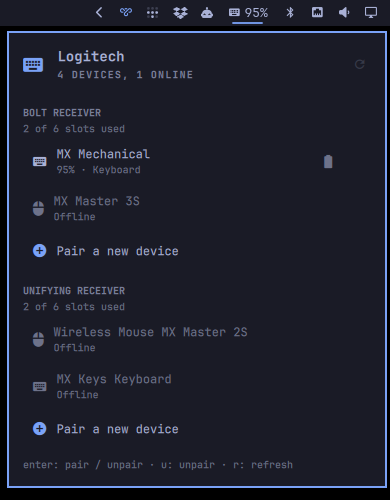

# Logitech Omarchy Widget

Bar widget for Logitech Unifying and Bolt receivers: paired devices, battery
levels, pairing, and unpairing — without running Solaar's GTK tray icon.



It uses Solaar's `logitech_receiver` Python library for status (a JSON snapshot
rather than the several hundred lines `solaar show` prints) and Solaar's own
`solaar pair` / `solaar unpair` for the state-changing operations.

## Requirements

- Omarchy 4 (Quattro) or newer, running the Quickshell-based `omarchy-shell`
- [Solaar](https://pwr-solaar.github.io/Solaar/) — `sudo pacman -S solaar`.
  This supplies both the `logitech_receiver` Python library the widget reads
  and the udev rules that let your session talk to the receiver. Solaar's own
  GUI and tray are not used and do not need to run.
- A Logitech Unifying, Bolt, or Nano receiver

## Install

```bash
omarchy plugin add https://github.com/rkrdeano/omarchy-logitech.git --enable
```

That clones the plugin to `~/.config/omarchy/plugins/io.github.rkrdeano.logitech/`
and adds it to your bar. To place it by hand instead, drop `--enable` and run
`omarchy plugin enable io.github.rkrdeano.logitech --section right`.

Update later with `omarchy plugin update io.github.rkrdeano.logitech`.

## Remove

```bash
omarchy plugin remove io.github.rkrdeano.logitech
```

That deletes the plugin directory and its bar entry. Nothing else on the system
is touched: the widget writes no state of its own, and it never edits any
configuration outside the bar entry Omarchy manages for it. Solaar itself stays
installed — remove it with `sudo pacman -Rs solaar` if you no longer want it.

## Behaviour

- The bar shows the icon of whatever device is awake — mouse, keyboard, or the
  receiver itself when nothing is online — plus the lowest battery level.
- The icon turns urgent when any online device is at or below the low-battery
  threshold, and accent-colored while a pairing is in progress.
- **Left click** opens the panel. **Right click** refreshes.

Inside the panel:

- One section per receiver, listing its paired devices with battery and state,
  and a "Pair a new device" row.
- `j` / `k` or arrows move the cursor between devices and pair rows.
- `enter` on a pair row starts pairing; `enter` (or `u`, or `delete`) on a
  device row asks to unpair it, and a second `enter` confirms.
- `r` refreshes, `esc` backs out one layer at a time — pairing, then a pending
  unpair, then the panel.

## Pairing

Selecting "Pair a new device" runs `solaar pair` against that receiver and
shows its output live, because the instructions are things you must do while
the window is open:

- **Unifying**: turn the device on, or press and release its channel button.
- **Bolt**: long-press the device's pairing button. Bolt authenticates, so
  Solaar then prints a passkey — the widget pulls that line out and shows it
  large. Type it on the new keyboard and press enter, or for a mouse, click the
  left/right sequence shown.

The receiver's pairing window is 30 seconds. Cancelling closes it early.

## Reading device state

Polling opens the receiver's hidraw node and pings every paired device, which
wakes them, so the default interval is deliberately slow (120s). A refresh also
runs when the panel opens, and `udevadm monitor` triggers one whenever a
receiver is plugged in or pulled out.

Offline devices report no battery — that is the device being asleep or off, not
an error. Wake it and refresh.

Polls, pairs, and unpairs never overlap: they all want exclusive access to the
same receiver, and a poll landing mid-pairing breaks the pairing.

## Permissions

No `sudo` or `pkexec`. Solaar's udev rule
(`/usr/lib/udev/rules.d/42-logitech-unify-permissions.rules`) grants the local
session access to Logitech hidraw nodes. If the panel shows nothing with a
receiver plugged in, check that:

```bash
ls -l /dev/hidraw*        # Logitech nodes should be group-accessible (crw-rw----+)
solaar show               # should list the receiver
```

## Solaar's own GUI

Nothing here stops `solaar` from running; it is just not needed. Launching
`solaar` opens the full GUI with per-device settings (DPI, scroll wheel, key
remapping) that this widget deliberately does not duplicate. Do not run the
Solaar tray at the same time as heavy use of this widget — both talk to the
same receivers, and they can trip over each other.

## Handling untrusted device input

A peripheral chooses its own name, and `solaar` output is process text, so both
are treated as untrusted:

- Every label in the panel sets `textFormat: Text.PlainText`. Qt's default is
  `AutoText`, which renders anything markup-shaped as rich text and loads the
  resources it names — inside the long-lived shell process. Labels this plugin
  does not own (the bar tooltip and `PanelHero`) cannot be configured that way,
  so strings passed to them are stripped of `<`, `>` and `&` first, which keeps
  Qt off the rich-text path entirely.
- `bin/logi-status` scrubs control characters and truncates every string it
  emits; `Model.js` re-applies the same caps when parsing, so the UI does not
  depend on its own helper having been the only source.
- Receiver, device, and pairing-transcript counts are bounded, battery levels
  are clamped, and pairing stops on a deadline, so neither a chatty process nor
  a device with a very long name can grow the shell's state without limit.

`node test/sanitization.test.js` exercises all of the above.

## Settings

Configure in `~/.config/omarchy/shell.json` on this widget's bar entry:

| Key | Default | Meaning |
|-----|---------|---------|
| `refreshIntervalSec` | `120` | Background poll interval |
| `showBattery` | `true` | Show the lowest battery level next to the bar icon |
| `lowBatteryPercent` | `20` | Threshold for the urgent color |
| `hideWhenNoReceiver` | `true` | Hide the icon when no receiver is plugged in |

Example:

```json
{ "id": "io.github.rkrdeano.logitech", "lowBatteryPercent": 15, "showBattery": false }
```

## IPC

```bash
qs -p /usr/share/omarchy/shell ipc call io.github.rkrdeano.logitech status
qs -p /usr/share/omarchy/shell ipc call io.github.rkrdeano.logitech battery
qs -p /usr/share/omarchy/shell ipc call io.github.rkrdeano.logitech refresh
qs -p /usr/share/omarchy/shell ipc call io.github.rkrdeano.logitech pair          # first receiver
qs -p /usr/share/omarchy/shell ipc call io.github.rkrdeano.logitech pair bolt     # or by kind/serial
qs -p /usr/share/omarchy/shell ipc call io.github.rkrdeano.logitech cancelPair
```

Handy for a Hyprland keybinding:

```lua
o.bind("SUPER SHIFT", "L", "Pair a Logitech device",
  "qs -p /usr/share/omarchy/shell ipc call io.github.rkrdeano.logitech pair")
```

## Files

- `manifest.json` — plugin metadata and settings schema
- `Service.qml` — polling, udev monitoring, pairing and unpairing processes
- `Panel.qml` — bar icon, device list, pairing card, inline unpair confirmation
- `Model.js` — JSON parsing and sanitizing, row building, battery and
  pairing-line formatting
- `test/sanitization.test.js` — bounds and escaping checks for device input
- `bin/logi-status` — JSON snapshot of receivers and devices
- `bin/logi-pair` — line-buffered `solaar pair` wrapper
- `bin/logi-unpair` — `solaar unpair` wrapper

## License

[MIT](LICENSE) © Dean Roker
